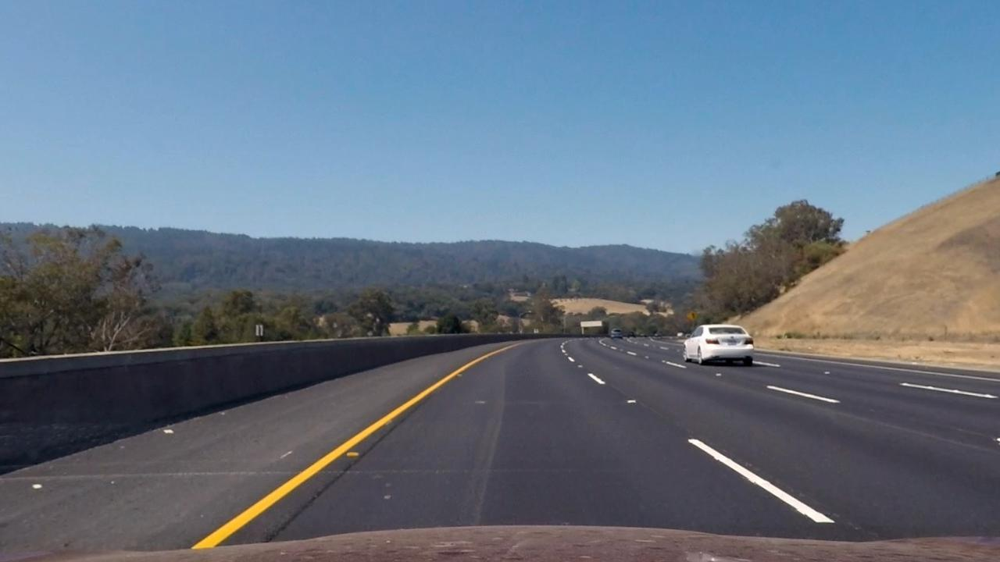
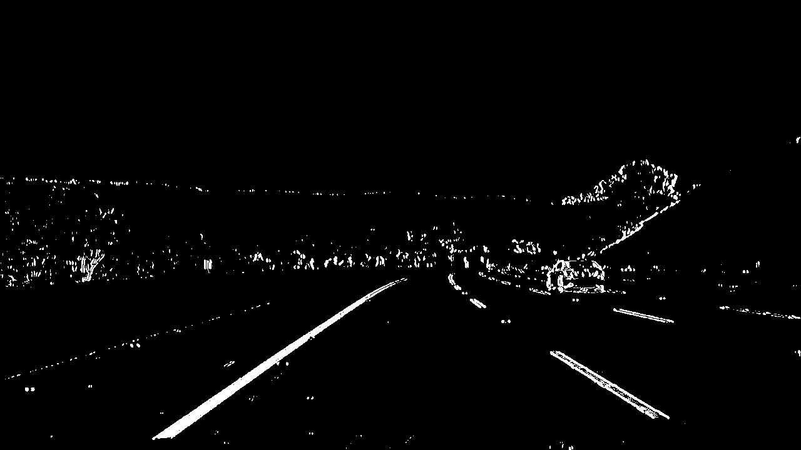
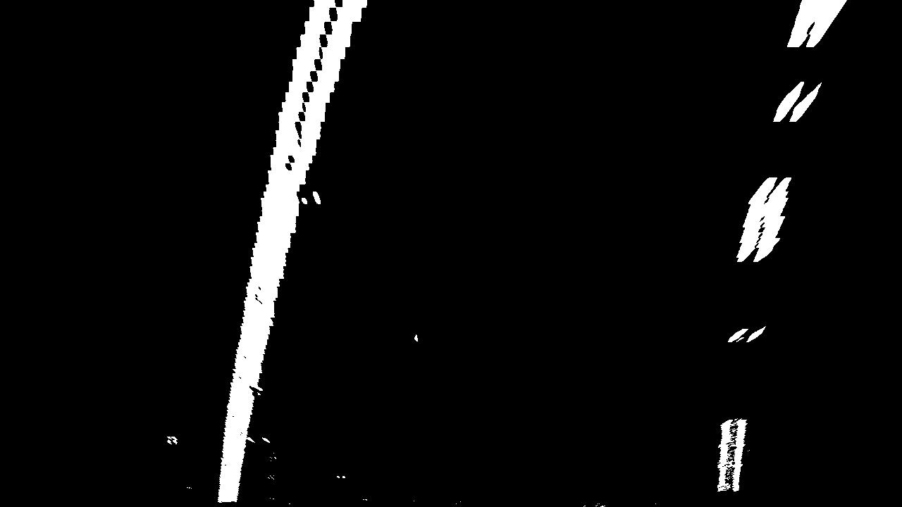
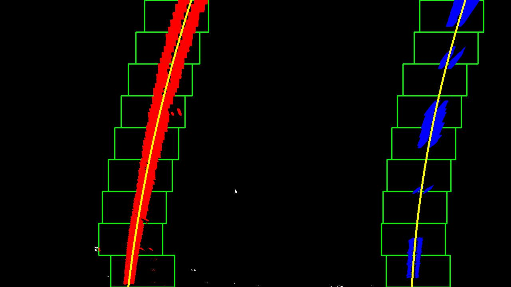
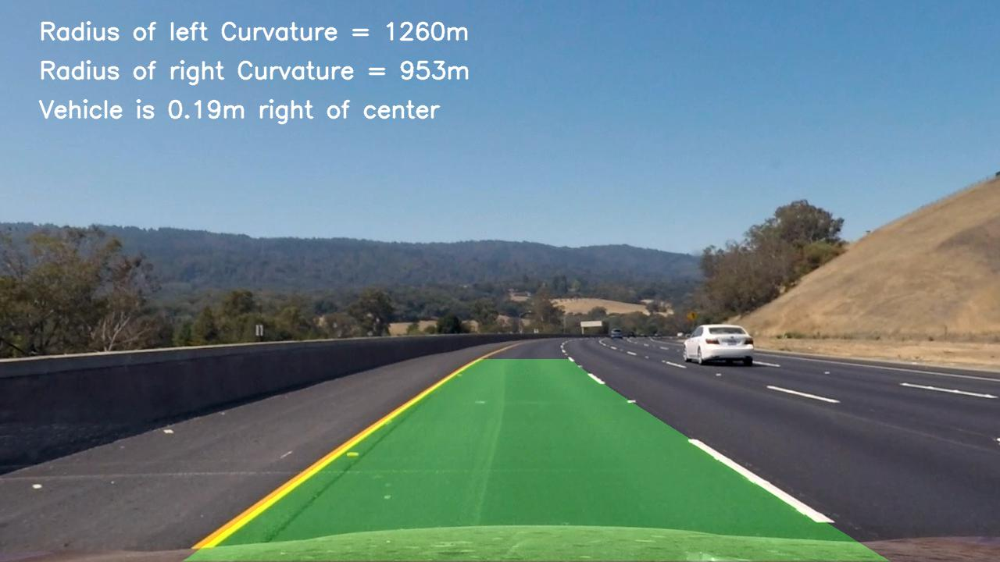

#  Advanced Lane Finding Project

The goals / steps of this project are the following:

* Compute the camera calibration matrix and distortion coefficients given a set of chessboard images.
* Apply a distortion correction to raw images.
* Use color transforms, gradients, etc., to create a thresholded binary image.
* Apply a perspective transform to rectify binary image ("birds-eye view").
* Detect lane pixels and fit to find the lane boundary.
* Determine the curvature of the lane and vehicle position with respect to center.
* Warp the detected lane boundaries back onto the original image.
* Output visual display of the lane boundaries and numerical estimation of lane curvature and vehicle position

The code is contained in the first code cell of the IPython notebook located in "Advanced_Lane_Finding.ipynb". 

### Camera Calibration

Code: In [3], In[4]

I start by preparing "object points", which will be the (x, y, z) coordinates of the chessboard corners in the world. Here I am assuming the chessboard is fixed on the (x, y) plane at z=0, such that the object points are the same for each calibration image.  Thus, `objp` is just a replicated array of coordinates, and `objpoints` will be appended with a copy of it every time I successfully detect all chessboard corners in a test image.  `imgpoints` will be appended with the (x, y) pixel position of each of the corners in the image plane with each successful chessboard detection.  

I then used the output `objpoints` and `imgpoints` to compute the camera calibration and distortion coefficients using the `cv2.calibrateCamera()` function.  I applied this distortion correction to the test image using the `cv2.undistort()` function and obtained this result : 

(left: origin, right: undistorted)

​                    

 					       

### Pipeline (single images)

I will use an example picture for illustration:

#### 1. Distortion correction

Code: In [6]

Apply distortion correction on the example image using the matrix calculated from camera calibration.

Undistorted result:

#### 2.  Create  binary image with threshold

Code: In [8]

I used a combination of color and gradient thresholds to generate a binary image. I transformed the image to HLS channel. Then create a threshold in S channel and gradient threshold in L channel.  Here's an example of my output for this step. 

#### 3. Perspective transform

Code: In [9], In[10]

First I applied a mask and perspective transform on the region of interest. The code for my perspective transform includes a function called `warp()`,  The `warp()` function takes as inputs an image (`img`), as well as source (`src`) and destination (`dst`) points.  I hardcode the source and destination points in the following manner:

This resulted in the following source and destination points:

|  Source   | Destination |
| :-------: | :---------: |
| 585, 460  |   320, 0    |
| 230, 720  |  320, 720   |
| 1050, 720 |  960, 720   |
| 695, 460  |   960, 0    |

Result:

#### 4. Find pixels of line and fit

Code: In [11]

Since there is no prior fitted line given, I used sliding windows to get the pixels. Here is the steps.

- Populate the pixels of bottom half and choose the position which has most pixels as the start position.
- Use rectangle to find  pixels around this position. if there are more than certain pixels in a rectangle, then reset the position to the center of these pixels, else, keep the position and sliding vertically.
- After all pixels around  lines is found, fit it with second ordered polynomial.

I also wrote a function for there is prior curve given(Code: In [12]). It'll be used in video process.

Result:

 

#### 5.  calculated the radius of curvature of the lane and the position of the vehicle with respect to center.

Code: In [13]

The curvature of second ordered polynomial can be calculated by formula. (See https://en.wikipedia.org/wiki/Curvature)

The position of vehicle is the center of the image. The the bias of vehicle is the difference of center of image and center of lane lines.

#### 6. final result

Code In [14], In [15], In[16]

Plot lane area, then unwarp the image and add text on it.

 Result:

---

### Pipeline (video)

Here's a [link to my video result](./project_output_video.mp4)

---

### Discussion

- I don't know what is the distance ratio of real world and image. I just take the the values given in lecture. But I think there should be a method to calculate it.
- I didn't consider the failure of detection and the validation of result. It should be added to make the program robust.

